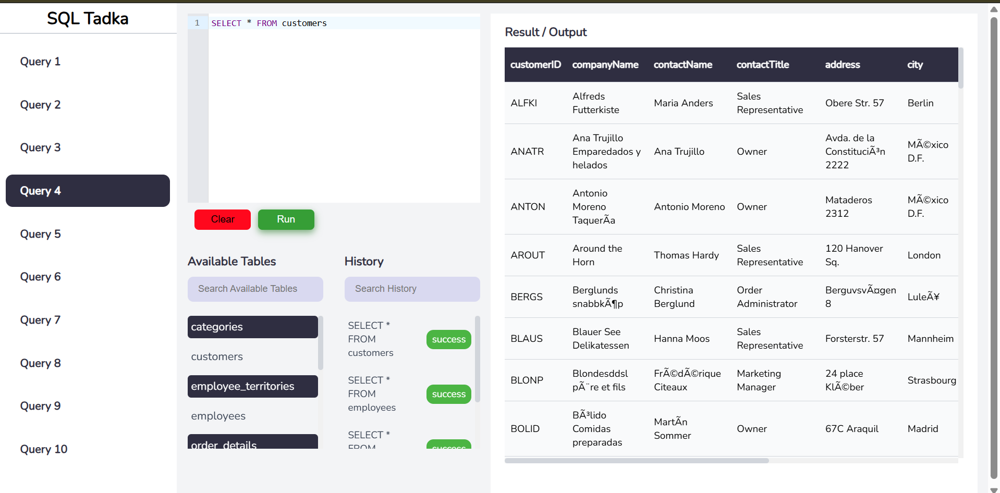
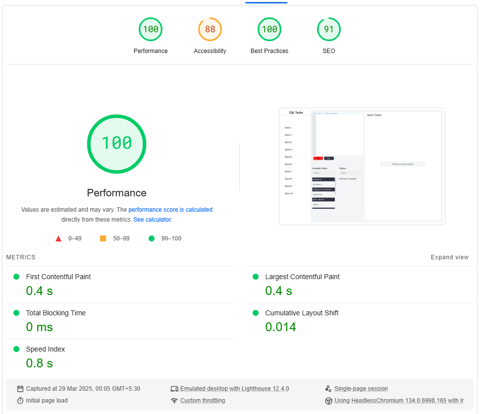
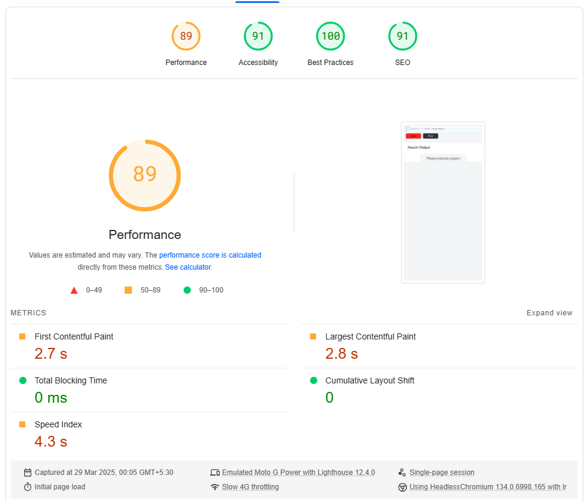

 
 
 

<h1 align="center">SQL Tadka - Built with React</h1>

 

## 🧐 Overview

This is a **ReactJS** powered SQL Editor, allowing users to execute SQL queries effortlessly.

The application features an intuitive SQL editor where users can write queries and interact with two key buttons: **Clear** and **Run**. Upon clicking **Run**, the editor extracts the table name from the query and checks if it exists in a predefined list of supported tables (**TABLE_NAMES**). If the table exists, an API request fetches data from a URL, and the query is executed using **alasql**, returning results in JSON format, which are then displayed in a structured table.

### Key Features:

- **Table Names Section** - Displays supported table names for easy reference. Includes a **search bar**.
- **History Panel** - Stores previously executed queries with their status. Also includes a **search bar**.

> _Currently, only `SELECT` queries are supported. More functionalities will be added in future updates._

 

## 🚀 Live Demo

The application is hosted on Vercel. Check it out here:

<h3><a href="https://sql-tadka.vercel.app/">SQL-Tadka</a></h3>

 

## 📝 Sample Queries to Try

1. `SELECT * FROM Customers;`
2. `SELECT * FROM Categories;`
3. `SELECT * FROM Employee_territories;`
4. `SELECT * FROM Employees;`
5. `SELECT * FROM Orders;`
6. `SELECT * FROM Products;`

 

## 🛠 Tech Stack

 

## 📦 Major Dependencies

- **@uiw/react-codemirror** `4.8.1` - SQL editor component
- **alasql** `1.7.3` - SQL engine for processing CSV data
- **react-hot-toast** `2.2.0` - Notifications for success and error messages
- **react-loader-spinner** `5.1.5` - Loading spinner for table results
- **react-table** `7.8.0` - Dynamic table rendering for query results

 

## ⚡ Performance Insights

Using Lighthouse Chrome DevTools, the application's performance was analyzed:

### Desktop Performance

### Mobile Performance

- **Performance score ranges between 96-98**
- Other metrics remain consistent

 

## 🔧 Optimization Techniques

To enhance performance, the following strategies were implemented:

- Used React's **memo, useMemo, and useCallback** hooks to reduce unnecessary re-renders.
- Applied **code-splitting** to the SQL editor component for faster initial load times.

 

<h3 align="center">🎉 Thank You for Checking Out SQL Tadka! 🎉</h3>
